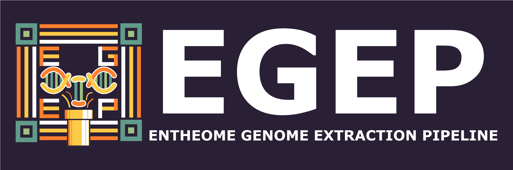

# EGEP Pipeline

<div align="center">
  
</div>

## Overview

EGEP (Entheome Genome Extraction Pipeline) is a versatile bioinformatics pipeline for mining multiple assembled genomes of the same genus of organism for perinant data.

### Pipeline Diagram
``` bash
[Input Data: Fungal Assemblies]
        |
        v
[1. FindAssemblyList] ----> Assembly List (Psilocybe + Agrocybe)
        |                        (Filters raw FASTA files)
        v
[2. GenerateNecessaryBuscos] ----> BUSCO Files
        |                        (Identifies conserved orthologs)
        v
[3. InitializeCompiledList] ----> Compiled BUSCO JSON
        |                        (Aggregates BUSCO data)
        v
[4. FilterAssemblies] ----> Filtered Assemblies + Total BUSCOs
        |                        (Removes outliers, computes totals)
        v
[5. ExtractInitialBuscos] ----> Shared BUSCO IDs + Overlap Stats
        |                        (Identifies common BUSCOs across assemblies)
        v
[6. ExtractBuscoSequences] ----> Concatenated FASTA
        |                        (Extracts sequences for shared BUSCOs)
        v
[7. InferBuscoGeneTrees] ----> Gene Trees
        |                        (Splits FASTA with split_busco_loci.py, then MAFFT + IQ-TREE per locus)
        v
[8. AlignSequencesWithMafft] ----> Concatenated Alignment (MSA)
        |                        (Aligns all BUSCO sequences)
        v
[9. TrimAlignmentWithTrimal] ----> Trimmed MSA
        |                        (Removes noisy/gappy regions)
        v
[10. RunIqTree] ----> Concatenated Tree (Bootstrap + gCF/sCF)
        |                        (Infers phylogeny with robust support)
        v
[11. ConvertIqTree] ----> Newick Tree
        |                        (Formats tree for downstream use)
        v
[12. ExtractBestModel] ----> Best-Fit Model
        |                        (Extracts model for BEAST2)
        v
[13. ConvertToNexus] ----> Nexus Alignment
        |                        (Prepares MSA for BEAST2)
        v
[14. RunBEAST2] ----> Dated Tree + MCMC Outputs
        |                        (Molecular clock analysis with calibration)
        v
[15. PrintRunSummary] ----> Summary Report
                                 (Stats: BUSCOs, Overlap, Model, Clock Rate, Paths)
```

### Pipeline Details
This pipeline processes fungal genomic assemblies to produce a dated phylogenetic tree, leveraging BUSCO orthologs and robust phylogenomic methods.
 - Steps 1–6: Start with fungal assemblies, identify and filter BUSCO orthologs using compleasm, and extract shared sequences for concatenation. This ensures only high-quality, conserved markers are used.
 - Step 7: Infer gene trees for each BUSCO locus by first splitting the concatenated FASTA with split_busco_loci.py, then aligning with MAFFT and inferring trees with IQ-TREE. This enables concordance factor analysis later.
 - Steps 8–9: Align concatenated sequences with MAFFT, then clean with TrimAl (-gt 0.8, -st 0.1, -cons 60) to reduce noise from annotation errors or gaps, as suggested by Dr. Jason Slot.
 - Step 10: Use IQ-TREE to build a concatenated tree with ultrafast bootstrap (1000 replicates) and concordance factors (gCF/sCF), providing dual support metrics per Dr. Slot’s recommendation.
 - Steps 11–14: Convert outputs to Newick/Nexus formats, extract the best-fit model, and run BEAST2 for molecular clock dating, calibrated at the Agrocybe-Psilocybe split (67.6 ± 6 Mya).
 - Step 15: Generate a summary report with key stats (BUSCO counts, overlap, model, clock rate) and file paths for validation.

## Quality Control Checks
 - Data Quality: BUSCO filtering and TrimAl minimize noise from incomplete assemblies or misannotations, ensuring a clean dataset.
 - Support Metrics: Combining bootstrap with concordance factors (gCF/sCF) in IQ-TREE offers a comprehensive view of tree reliability, critical for fungi where gene tree discordance is common.
 - Temporal Context: BEAST2’s molecular clock anchors the phylogeny with a calibration point, enhancing evolutionary inference.
 - Reproducibility: Nextflow ensures consistent execution across runs, making the pipeline scalable and verifiable.

## Contribution

If you would like to contribute to the EGAP Pipeline, please submit a pull request or open an issue on GitHub. For major changes, please discuss via an issue first. 

## License

This project is licensed under the BSD 3-Clause License.
